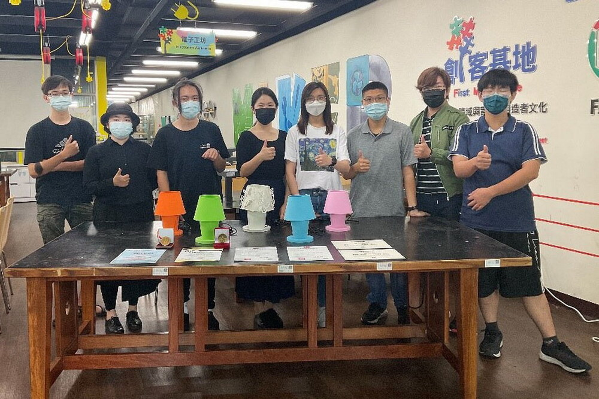

# 2022-sasd
111-1 高科大系統分析與設計



# 柯永誠
## 柯永誠

##### 國立高雄科技大學　資訊管理系(所)
##### 創新創業教育中心　兼任專案助理
##### 電話：0972-613328
##### 信箱：C109118110@nkust.edu.tw
##### 傳檔服務：https://nkust.cc


# 工作清單
- [ ] todo list
- [X] 已完成
- [ ] 未完成

[](https://www.youtube.com/watch?v=StTqXEQ2l-Y "Everything Is AWESOME")

# Python 實作
```python
s = "Python syntax highlighting"
print(s)
```

# 個人簡歷
| 項目        | 比賽           | 得名  |
| ------------- |:-------------:| -----:|
| 1        | 賽普勒斯國際設計競賽      | 金牌 |
| 2        | 烏克蘭國際設計競賽      | 金牌   |
| 3      | FLUX 雷雕設計大賽      | 第三名    |

補充：每個標頭元件都要用至少三個破折號分隔開來。
最外面的豎線可以省略，你也不需要讓原始的文字排列整齊。你也可以使用行內樣式的 Markdown。

不 | 漂亮 | 的文字
--- | --- | ---
*依然* | `渲染的` | **很好**
1 | 2 | 3


# Highlight

重點，又被稱為斜體，在兩邊加上 *星號* 或是 _下劃線_ 。

更強的重點，又稱為粗體，在兩邊加上 **兩個星號** 或是 __兩個下劃線__ 。

也可以用 **星號與 _下劃線_** 結合重點。

刪除線使用兩個波浪符號。 ~~刪除這個。~~

# 階層 

1. 第一個有序列表項目
2. 另一個項目
⋅⋅⋅* 無序子列表 
1. 實際數字不重要，只要它是一個數字
⋅⋅⋅1. 有序子列表
4. 與其他項目

⋅⋅⋅要在列表項目下加入段落，只要縮進就好了。注意前面的空白行，以及前置的空白（至少要一個空白，不過我們在這裡會使用三個空白以剛好對齊原始的文字）。

⋅⋅⋅要使文字段行而不會成為新的段落，你只需要在後面加上兩個空白。⋅⋅
⋅⋅⋅注意這行已經分開了，不過還是在同樣的段落中。
⋅⋅⋅（如果不要求後面的兩個空格，就為伴了典型的 GFM 斷行格式。）

* 無序列表可以使用星號
- 或減號
+ 或加號
